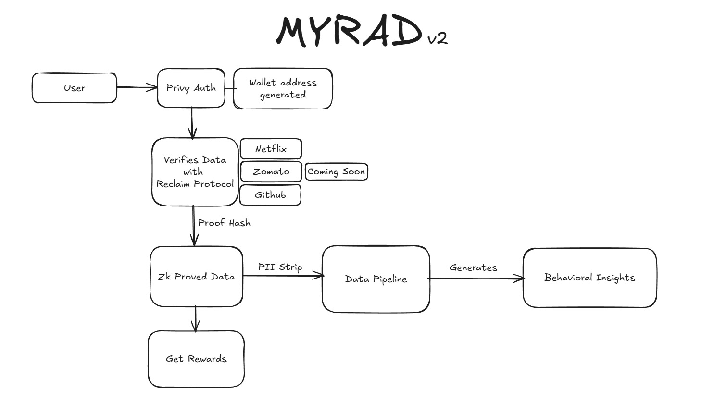

# MYRAD — Turn Your Data Into Rewards

**Live Demo:** [https://myradhq.xyz/](https://myradhq.xyz/)

> *Your data has value. Now you can own it, control it, and earn from it—without ever exposing who you are.*

---

## The Problem We Solve

Every day, you generate valuable data—ordering food, shopping online, browsing apps. Companies collect this data and profit billions from it. **You get nothing.**

Even worse, your personal information gets sold, leaked, or misused.

**MYRAD changes this equation.**

---

## What is MYRAD?

MYRAD is a **privacy-first data rewards platform** that lets you earn money from your app activity—without ever revealing your personal information.

Here's the magic: We use **zero-knowledge cryptography** to prove your data is real without seeing the actual data. Your privacy stays intact. Your rewards stay real.

| Traditional Data Companies | MYRAD |
|---------------------------|-------|
| Collect your raw data | Never sees your raw data |
| Sell your personal info | Only works with anonymous insights |
| You get nothing | **You earn points & rewards** |
| Privacy risks | **Cryptographically protected** |

---

## How It Works



### For You (The User)

1. **Sign Up in Seconds**  
   Use your email or social accounts. No complicated wallet setup required—we handle that for you.

2. **Connect Your Apps**  
   Link apps like Zomato, Swiggy, or GitHub. We use the **Reclaim Protocol** to verify your activity without ever accessing your actual data.

3. **Your Data Stays Private**  
   A **Zero-Knowledge Proof** (think of it as a "verified stamp") confirms your activity is real. No personal details, no order history, no addresses ever leave your device.

4. **Earn Rewards Instantly**  
   Every verified contribution earns you points. Track your balance in real-time and redeem for rewards!

### For Businesses (Data Buyers)

- **API Access** to privacy-compliant, aggregated consumer insights
- **Real Behavioral Data** verified by cryptographic proofs
- **100% Consent-Based** — only data users choose to share
- **GDPR & CCPA Ready** — built for compliance from day one

---

## Why Zero-Knowledge Proofs Matter

**The Simple Explanation:**  
Imagine proving you're over 21 without showing your ID. That's what zero-knowledge proofs do—they verify facts without revealing the underlying information.

**The Technical Reality:**  
ZK proofs are cryptographic protocols that allow one party to prove knowledge of a value without revealing the value itself. MYRAD uses the Reclaim Protocol's attestation network to generate TLS-based proofs that verify data authenticity directly from source APIs.

**What This Means For You:**  
- Your Zomato order history? Never seen by us.
- Your delivery address? Stays on your phone.
- Your spending patterns? Verified, not exposed.

---

## Features

### Privacy by Design
- No raw data collection—ever
- Zero-knowledge verification
- User-controlled data deletion
- End-to-end encryption

### Reward System
- 100 points welcome bonus
- 25 points per Zomato contribution
- 15 points per GitHub contribution
- 20 points per Netflix contribution
- Real-time balance tracking

### Enterprise-Grade API
- RESTful endpoints with rate limiting
- Aggregated behavioral analytics
- Queryable demographic segments
- Full compliance documentation

---

## Tech Stack

| Layer | Technology | Why We Chose It |
|-------|------------|-----------------|
| **Frontend** | React 18 + TypeScript | Fast, type-safe, production-ready |
| **Styling** | Vanilla CSS + Tailwind | Maximum flexibility |
| **Authentication** | Privy Auth | Email, social, and wallet support |
| **Data Verification** | Reclaim Protocol | Industry-leading ZK proofs |
| **Backend** | Express.js | Lightweight, scalable API |
| **Database** | PostgreSQL | Reliable, queryable analytics |

---

## Currently Supported Platforms

| Platform | Data Type | Reward | Status |
|----------|-----------|--------|--------|
| Zomato | Order History | 25 pts | Live |
| GitHub | Developer Profile | 15 pts | Live |
| Netflix | Watch History & Ratings | 20 pts | Live |
| Swiggy | Order History | 25 pts | Coming Soon |
| More... | — | — | Roadmap |

---

## Getting Started

### Prerequisites
- Node.js 18+
- npm or yarn

### Quick Setup

```bash
# Clone the repository
git clone https://github.com/Myrad-Labs/MYRAD.git
cd MYRAD

# Install dependencies
npm install

# Set up environment variables
cp .env.example .env
# Edit .env with your API keys

# Start development server
npm run dev
```

### Environment Variables

```env
# Frontend (Vite)
VITE_PRIVY_APP_ID=your_privy_app_id
VITE_RECLAIM_APP_ID=your_reclaim_app_id
VITE_RECLAIM_APP_SECRET=your_reclaim_secret
VITE_ZOMATO_PROVIDER_ID=your_zomato_provider_id
VITE_GITHUB_PROVIDER_ID=your_github_provider_id
VITE_NETFLIX_PROVIDER_ID=your_netflix_provider_id

# Backend
DATABASE_URL=your_neon_postgres_connection_string
PORT=4000
ADMIN_SECRET=your_secure_admin_secret
```

### Database Setup (Recommended)

1. Create a free PostgreSQL database on [Neon](https://neon.tech)
2. Copy your connection string to `DATABASE_URL`
3. Run migrations: `npm run db:migrate`

---

## Project Structure

```
MYRAD/
├── src/                    # React frontend
│   ├── pages/              # Page components
│   ├── components/         # Reusable UI components
│   └── providers/          # Auth providers
├── backend/                # Express.js API
│   ├── zomatoPipeline.js   # Zomato data processing
│   ├── githubPipeline.js   # GitHub data processing
│   └── database/           # PostgreSQL integration
└── public/                 # Static assets
```

---

## Security & Compliance

MYRAD is built with privacy as a fundamental principle:

| Protection | How We Implement It |
|------------|---------------------|
| **Data Minimization** | We never see or store raw user data |
| **Zero-Knowledge** | Cryptographic proofs verify without exposing |
| **User Consent** | Explicit opt-in for every data share |
| **Right to Delete** | Users can remove all data instantly |
| **Encryption** | All data in transit uses TLS 1.3 |
| **Compliance** | GDPR & CCPA compatible by design |

---

## Community & Support

- [Telegram](https://t.me/myradhq) — Join our community
- [X (Twitter)](https://x.com/myradhq) — Follow for updates
- Email: hello@myradhq.xyz

---

## License

Copyright © 2024 MYRAD Labs. All rights reserved.

---

<p align="center">
  <strong>MYRAD</strong> — Your Data, Your Rewards, Your Privacy
</p>
